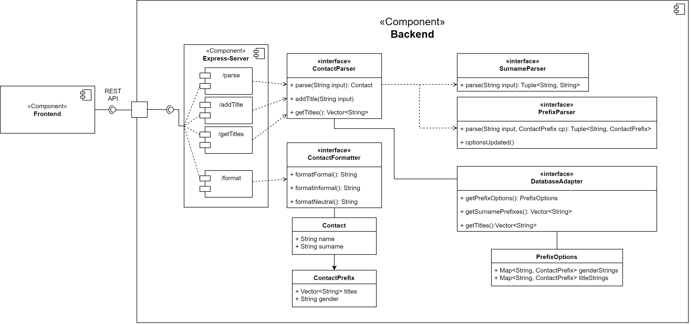

# Aaltimate-Kontaktsplitter

## Beschreibung

Dieses Projekt ist ein Prototyp für eine Anwendung, die einen Kontakt-String parst und in seine Bestandteile aufteilt und ist für die Vorlesung "Softwarequalität" an der DHBW-Stuttgart-Horb entwickelt.

<!-- Überprüfe den obigen satz und schriebe ihn neu -->

## Model

<!-- Insert the pic from data/AbgabeModel.png -->

## Dependencies

- [Node/NPM](https://nodejs.org/de/)

## Installation

1. Repository klonen: `git clone <https://github.com/Lok-Aal/Aaltimate-Kontaktsplitter>`
2. In das Projektverzeichnis wechseln: `cd Aaltimate-Kontaktsplitter`
3. Dependencies installieren: `npm install`
4. Projekt starten: `npm start`

Projekt sollte nun unter [localhost:3000](http://localhost:4200) erreichbar sein.
